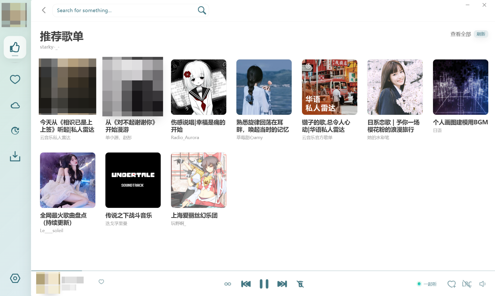
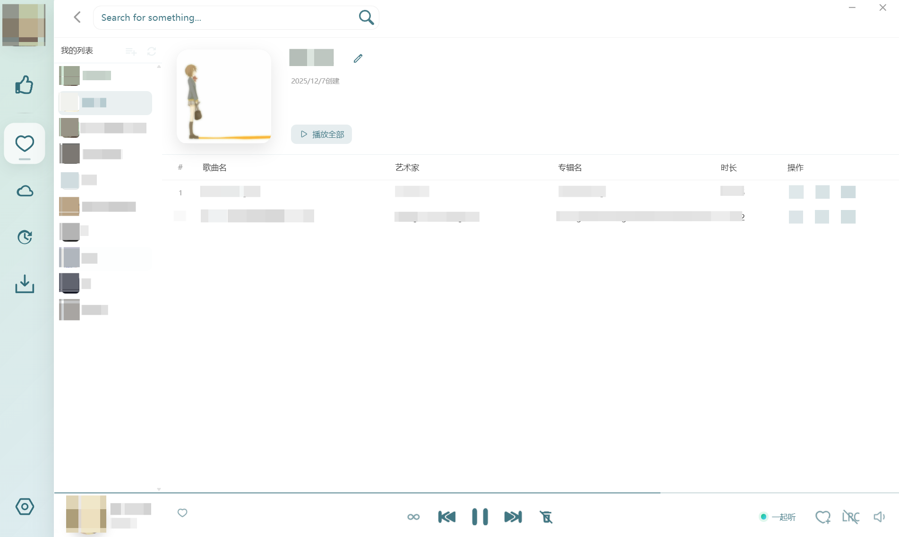

# LX Music Desktop

本仓库是由 `starkyYourEyes` 维护的 LX Music 桌面定制版。显示名称和现有图标继续使用 LX Music，技术标识、发布目标、数据目录、深链、同步身份与备份扩展名由本仓库独立维护。

## 当前功能

- 本地音乐、在线源、自定义源、歌单与桌面歌词。
- WebDAV 音乐与本地音乐上传。
- 账号推荐、私人 FM、每日推荐和歌单管理。
- 桌面端同步服务与一起听功能。
- Windows、macOS 与 Linux 构建配置。

## 下载与反馈

- Releases: <https://github.com/starkyYourEyes/lx-music-desktop/releases>
- Issues: <https://github.com/starkyYourEyes/lx-music-desktop/issues>

本项目没有内置应用更新检查。请从本仓库 Releases 获取新版本，并在提交问题前搜索现有 Issues。

## 数据与兼容性

- 安装版首次使用新技术标识时，会把旧安装目录中的用户数据复制到新目录；旧目录不会被删除或覆盖。
- 便携版继续使用程序旁的 `portable/userData`。
- 新备份使用 `.slxmc`；导入同时接受 `.slxmc`、旧 `.lxmc` 和已有 JSON 备份。
- 新深链格式为 `starkylx://music/play` 或 `starkylx://music/search/...`，不兼容旧深链。
- 桌面同步只接受当前版本使用的新桌面端和移动端身份。

## 使用入口

- 自定义源：在“设置 -> 基本设置 -> 自定义源”导入本地 JavaScript 源文件或在线源。
- 数据同步：在“设置 -> 数据同步”选择服务端或客户端模式，并按界面显示的地址和认证码连接。
- 开放 API：在“设置 -> 开放 API”启用服务、设置端口，并仅在可信网络中开放局域网访问。
- WebDAV：在“设置 -> 其他”配置地址、用户名和密码。

## 开发

```powershell
npm install
npm run dev
npm run lint
npm run build
npm run pack:dir
```

项目要求 Node.js 22 或更新版本。打包产物写入 `build/`，编译结果写入 `dist/`。

## 界面





## 许可证与来源

代码继续按 [Apache License 2.0](./LICENSE) 发布，应用内补充协议与第三方许可证保留在 [`licenses/`](./licenses/) 目录。

本项目基于 [lyswhut/lx-music-desktop](https://github.com/lyswhut/lx-music-desktop) v2.12.1，感谢原作者及贡献者。基线之后的修改和发布由当前维护者负责，详细说明见 [UPSTREAM.md](./UPSTREAM.md)。
