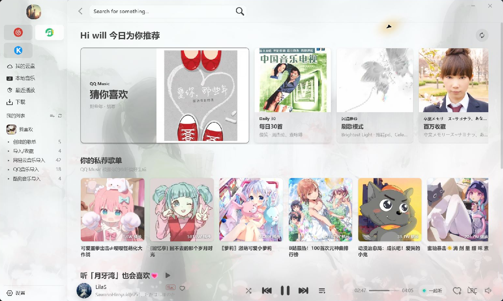
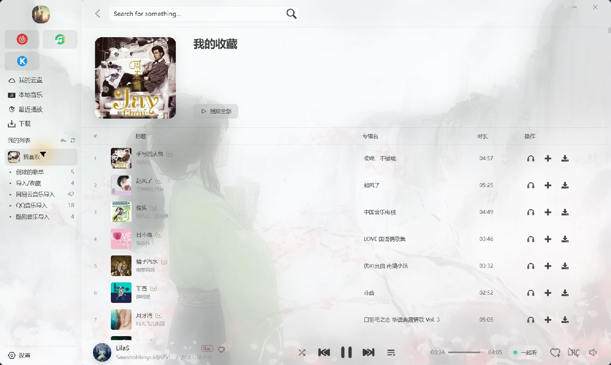

# LX Music 桌面重置版：多平台推荐、歌单管理与个人音乐库

LX Music 桌面重置版——把不同平台的推荐和歌单，以及本地、云端的音乐收藏，放进同一个桌面播放器，让找歌、整理和播放都更方便。

项目基于 [LX Music Desktop](https://github.com/lyswhut/lx-music-desktop) v2.12.1。在原项目的基础上进行定制开发，后续修改和版本发布由我独立维护，显示名称和图标继续使用 LX Music。感谢原作者和贡献者，下面介绍的功能包含原版能力与我在定制版中做的扩展。

## 版本概览

想快速了解这个版本，可以先看这张表：

| 功能 | 当前能做什么 | 对日常使用的帮助 |
|---|---|---|
| 多平台推荐 | 接入网易云音乐、QQ 音乐和酷狗音乐的账号推荐 | 在一个播放器里浏览不同平台的推荐内容 |
| 平台歌单 | 读取已创建、已收藏的歌单，并提供刷新入口 | 集中访问已有收藏 |
| 个人列表 | 歌单分组、排序、歌曲去重、侧栏入口 | 歌单多了也方便整理和查找 |
| 本地音乐与 WebDAV | 扫描本地目录、播放远端音乐、上传本地歌曲 | 把硬盘和个人云端收藏一起管理 |
| 播放与音源 | 自定义源、备用源顺序、音质偏好 | 减少手动切源，按需选择播放方式 |
| 界面与歌词 | 主题、背景、布局调整、桌面歌词 | 按屏幕和阅读习惯调整界面 |
| 一起听*（需要sync服务支持）* | 房间播放同步、共享待播队列 | 和朋友共同选歌、同步收听 |
| 听歌统计 | 时长记录、最近七天概览、常听歌曲 | 随时回看自己的听歌习惯 |
| 数据管理 | 备份、导出、兼容设备同步、便携版 | 换设备时带走歌单与配置 |

## 多平台推荐

**多平台推荐**是这个版本的重点之一。登录对应账号后，就能在软件内访问平台提供的个性化内容：

| 平台 | 已接入的主要内容 |
|---|---|
| 网易云音乐 | 每日推荐、私人 FM、雷达歌单、风格推荐、相似歌曲 |
| QQ 音乐 | 猜你喜欢、每日 30 首、刷歌模式、专属推荐歌单 |
| 酷狗音乐 | 每日推荐、风格推荐、私人 FM、精选歌单和榜单 |

*图 1：当前使用的 QQ 音乐推荐页，上方是常用推荐入口，下方是私荐歌单。截图保留了当前的背景主题。*

这些入口对应几种常见的听歌方式：

- **有明确目标**：直接搜索歌曲，或者打开已经收藏的歌单。
- **想发现新歌**：浏览每日推荐、风格推荐和推荐歌单。
- **想连续听下去**：打开私人 FM、猜你喜欢或刷歌模式，减少反复选歌的操作。
- **已经积累了平台偏好**：登录原有账号，继续浏览平台为这个账号生成的推荐。

推荐内容由对应平台提供，个性化功能需要登录，实际可用性取决于平台接口和账号状态。

## 歌单管理

在**歌单管理**上，我希望常听的收藏能随手找到，数量增加后也有办法整理。当前版本提供了这些功能：

- **读取平台歌单**：支持网易云音乐、QQ 音乐和酷狗音乐中“我创建的”“我收藏的”歌单。
- **刷新平台内容**：提供歌单刷新入口，方便重新读取平台上的收藏。
- **歌单分组**：可以按用途整理成“工作背景音”“完整专辑”“最近发现”等分组。
- **列表整理**：个人列表支持拖拽排序、重命名和歌曲去重。
- **侧栏访问**：保留“我喜欢”、个人歌单分组和平台导入入口，切换页面时也能访问收藏。

*图 2：我的“我喜欢”歌单，打开后的页面标题是“我的收藏”。列表展示封面、歌曲、歌手、专辑和时长，左侧保留了歌单分组与平台入口。*

平台歌单的读取、刷新与本地个人列表的编辑是不同功能。这里的重点是集中访问和整理，不代表所有本地编辑都会回写到平台账号。

## 本地音乐和WebDAV

同时支持**本地音乐和 WebDAV**。在线推荐用来发现音乐，已经保存的文件也应该能方便地继续听：

| 音乐放在哪里 | 使用方式 | 适合的场景 |
|---|---|---|
| 电脑硬盘 | 配置音乐目录，扫描后集中展示和播放 | 已经保存了专辑或本地音乐文件 |
| WebDAV 服务 | 配置连接后，浏览和播放远端音乐 | 在 NAS 或个人存储服务上管理收藏 |
| 准备上传的本地文件 | 将本地歌曲上传至 WebDAV | 把本地收藏逐步整理到自己的云端音乐库 |

这部分功能的好处是，在线音乐、硬盘文件和自己的云端收藏都能在同一套界面中访问。在其他设备上配置相应的 WebDAV 访问后，也能读取远端文件。

## 播放和音源

**播放和音源设置**方面，我保留了按需配置的空间：

- **自定义源**：支持导入本地源文件或在线源。
- **备用播放源**：可以设置备用源与尝试顺序，当前来源不可用时按配置尝试其他来源。
- **音质偏好**：可以设置优先播放的音质，播放栏提供音质信息展示。
- **常用控制**：支持循环、随机播放、快捷键和定时暂停。
- **音效调整**：提供均衡器、环境音效等设置。
- **下载管理**：启用后，可设置下载目录、文件命名，以及歌词、封面的保存选项。

具体歌曲能否播放或下载、有哪些音质，仍由所配置的音源决定。备用源可以增加尝试机会，无法保证所有歌曲始终可用。

## 界面设置

界面是每天都会接触的部分，所以我在定制版里继续调整了**布局与显示细节**，也保留了原有的主题和歌词设置：

| 可调整的部分 | 具体选项 |
|---|---|
| 整体外观 | 主题颜色、背景图片、背景透明度 |
| 字体与布局 | 字体大小、侧栏缩放、播放栏高度 |
| 播放详情 | 唱片转盘、歌曲封面、滚动歌词 |
| 桌面歌词 | 字体、颜色、透明度、置顶和锁定 |
| 扩展歌词 | 逐字歌词、翻译和罗马音，取决于歌词资源 |

我希望不同屏幕尺寸、不同阅读习惯的用户，都能调出适合自己的布局。上面的两张截图就是当前软件的实际界面，可以看到背景主题、歌曲封面和侧栏列表的显示效果。

## 一起听

除了自己听，还加入了**“一起听”**（但是需要单独的sync服务，暂时未发布），让几个人可以共同安排播放：

- **创建或加入房间**：在具备可用的房间服务连接后，进入同一个收听空间。
- **同步播放状态**：支持切歌、暂停和调整播放进度。
- **共同控制**：房间默认允许成员控制播放，也支持仅房主可控的模式。
- **共享待播队列**：成员可以把想听的歌曲加入“稍后播放”，一起决定接下来听什么。

比如朋友推荐了一首歌，就可以直接放进共享队列，听完当前这首接着听。

## 听歌统计

还做了**听歌统计**，方便随时回看收听记录：

- **累计时长**：查看已经记录的总听歌时间。
- **近期概览**：查看今日、最近七天的听歌记录。
- **常听歌曲**：按播放次数排列，看看哪些歌被反复播放。
- **实际播放计时**：按真正播放经过的时间累计，暂停和拖动进度不会被算成额外时长。

不用等年度报告，平时就能打开看看自己的听歌习惯。

## 其他

对于长期使用，我也重视**歌单和配置能否方便地保存、迁移**。目前提供了以下方式：

| 功能 | 用途 |
|---|---|
| 歌单与设置导入、导出 | 单独保存收藏或配置 |
| 完整备份 | 为换电脑、重装系统提前准备 |
| 文本与 CSV 导出 | 把歌单整理成可查看、可继续处理的文件 |
| 数据同步 | 通过服务端、客户端模式连接兼容设备 |
| Windows 便携版 | 把用户数据保存在程序旁，便于一起管理 |
| 开放 API | 为其他工具的对接提供入口 |

当前定制版使用**独立的同步身份**，多设备连接需要使用兼容的客户端版本。

如果准备试用，我建议按这个顺序开始：

1. 从 Releases 下载适合自己系统的版本。
2. 登录常用音乐平台，查看推荐内容和已有歌单。
3. 按需配置播放源，或添加自己的本地音乐目录。
4. 把常听歌单整理进分组，再调整字体、背景和播放栏。
5. 有 NAS、多设备或共同听歌需求时，再配置 WebDAV、数据同步和一起听。

关于版本获取和反馈，也集中说明一下：

- **项目维护**：这个定制版由我独立维护和发布，与原版发布渠道分开。
- **系统支持**：仓库提供 Windows、macOS 和 Linux 构建配置，实际安装包以 Releases 页面为准。
- **更新方式**：当前没有内置更新检查，需要从 Releases 获取新版本。
- **开源许可**：代码继续使用 Apache License 2.0，并保留相关补充协议与第三方许可证。
- **问题反馈**：欢迎在 Issues 中反馈。附上软件版本、系统、操作步骤和报错信息，会更方便我定位问题。

项目地址：[starkyYourEyes/lx-music-desktop](https://github.com/starkyYourEyes/lx-music-desktop)
